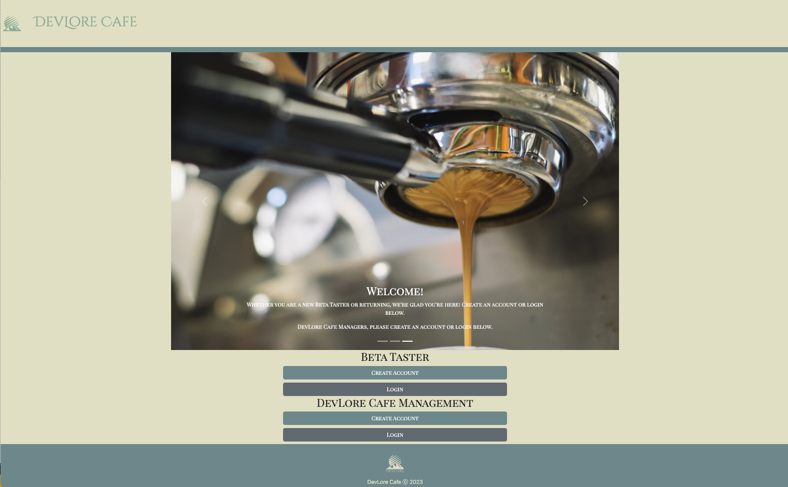

# Devlore Cafe

## Description

This project was built with the intention of creating a full-stack web application. The functionality of this site is to allow a restaurant to build and post a menu and allow users to come and review a given menu. This way, restaurants can have their first step into "Beta-Tasting" their menu prior to open!

### Table of Contents

[Challenge](https://github.com/hollyhleal/beta-tasters#challenge) 
[Development](https://github.com/hollyhleal/beta-tasters#development)  
[Installation](https://github.com/hollyhleal/beta-tasters#installation) 
[Links](https://github.com/hollyhleal/beta-tasters#links) 
[Credits](https://github.com/hollyhleal/beta-tasters#credits) 
[License](https://github.com/hollyhleal/beta-tasters#license) 

### Challenge

A huge challenge for us as a team was linking the routes for the front-end and back-end. We ran into many walls as a team with attemping to connect the dynamic aspects of the application. Such as: displaying newly posted menu Items / Reviews to the desired location.

Another challenge was incorporating the index templating engine, HandleBars. When displaying content stored in a SQL database, we had issues with the content being accessed using sequelize and properly displaying on the handlebars pages.

### Development

    Why did we use the technologies we did?
        - Using express, sequelize, mysql2, and handlebars were mandatory to use for this project, but also seamlessly joined together to create a smooth path way from front end to back end. Express was used to handle the hosting of the server when working in the development phase of the application. Sequelize and Mysql2 work wonderfully hand in hand to allow us to seed and store data. The sequelize package is what allowed us and the user to actively query into the SQL database and return a usable object to display within the handlebars index templating engine. Lastly, Handlebars is still a strong tool to be used today as it allows us, as devs, to not repeat ourselves with code and instead pass html code to a main handlebars file. This stopped us from having to copy over the same nav bar and footer for each file, and to avoid having to require in scripts to bootstrap and index.js files in multiple places.

    Icebox/Future Functions:
        -Want to add the functionality for user to delete specified comments
        -Allow Users to pick a specfic menu item to leave a review on
        -Live feed to show which Managers added which Menu Item
        -A specific link to allow the management team to allow only tea members to create accounts

### Installation

- bcrypt
- sequelize
- dotenv
- express
- handlebars
- mysql2
- nodemailer

### Links

[Front End Wireframe](https://drive.google.com/drive/folders/1JFznXxQksoPznwrlrvxQUpyQNjq2blIJ?usp=sharing) 
[Back End Wireframe](https://drawsql.app/teams/devlore/diagrams/devlore) 
[Heroku](https://secure-mesa-62807.herokuapp.com/)

### Screenshot

Link to Deployed Application: [https://secure-mesa-62807.herokuapp.com/](https://secure-mesa-62807.herokuapp.com/)

### Credits

[Keith Gibson](https://github.com/Keithgibson123) 
[Holly Leal](https://github.com/hollyhleal) 
[Michael Mount](https://github.com/MMount98) 
[Joshua Nelson](https://github.com/joshua-wade7) 
[Jacob](https://github.com/JThorneX) [Thorne](https://github.com/ShiningStars73)

### License
